**Introduction**

The lifecycle of a Data science project typically includes (often,
iteratively) the following steps:

- Business understanding

- Data acquisition

- Data exploration, cleansing, preparation, and visualization

- Model training and experiment tracking

- Model scoring and generating insights.

The goals and success criteria of each stage depend on collaboration,
data sharing and documentation. The Fabric data science experience
consists of multiple native-built features that enable collaboration,
data acquisition, sharing, and consumption in a seamless way.

In these tutorials, you take the role of a data scientist who has been
given the task to explore, clean, and transform a dataset containing the
churn status of 10000 customers at a bank. You then build a machine
learning model to predict which bank customers are likely to leave.

**Objective**

1.  Use the Fabric notebooks for data science scenarios.

2.  Ingest data into a Fabric lakehouse using Apache Spark.

3.  Load existing data from the lakehouse delta tables.

4.  Clean and transform data using Apache Spark and Python based tools.

5.  Create experiments and runs to train different machine learning
    models.

6.  Register and track trained models using MLflow and the Fabric UI.

7.  Run scoring at scale and save predictions and inference results to
    the lakehouse.

8.  Visualize predictions in Power BI using DirectLake.

## Task 1: Create a workspace 

Before working with data in Fabric, create a workspace with the Fabric
trial enabled.

1.  Open your browser, navigate to the address bar, and type or paste
    the following URL: +++https://app.fabric.microsoft.com/+++ then
    press the **Enter** button.

> **Note**: If you are directed to Microsoft Fabric Home page, then skip
> steps from \#2 to \#4.
>
> 

2.  In the **Microsoft Fabric** window, enter your credentials, and
    click on the **Submit** button.

> 

3.  Then, In the **Microsoft** window enter the password and click on
    the **Sign in** button**.**

> 

4.  In **Stay signed in?** window, click on the **Yes** button.

> 
>
> 

5.  In the **Fabric** home page, select **+New workspace**.

> 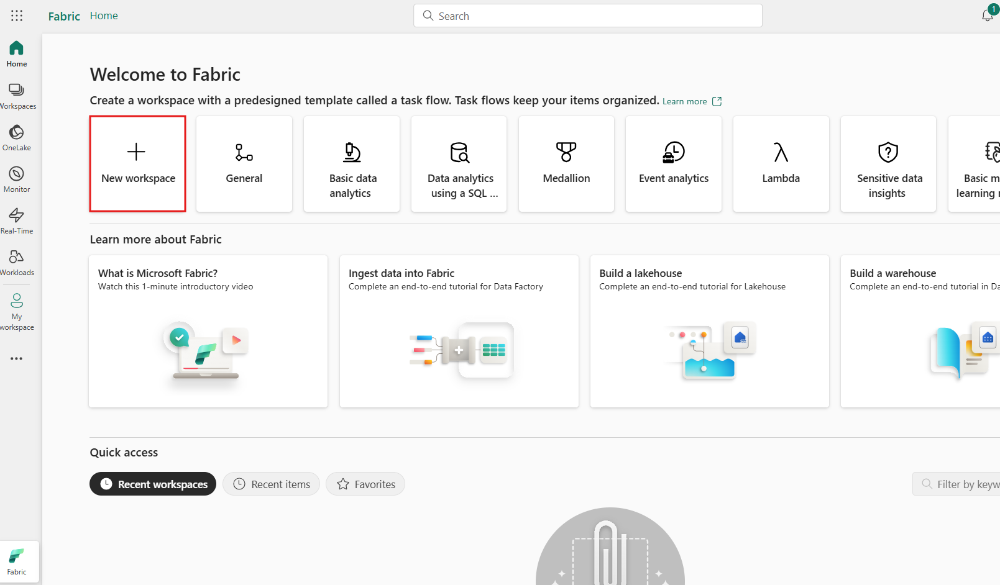

6.  In the **Create a workspace tab**, enter the following details and
    click on the **Apply** button.

[TABLE]

> 
>
> 

7.  Wait for the deployment to complete. It takes 2-3 minutes to
    complete. When your new workspace opens, it should be empty.

> 

## Task 2: Create a lakehouse and upload files

Now that you have a workspace, it’s time to switch to the *Data
engineering* experience in the portal and create a data lakehouse for
the data files you’re going to analyze.

1.  In the Fabric home page, Select **+New item** and
    select **Lakehouse**

2.  In the **New lakehouse** dialog box,
    enter **+++FabricData_Sciencelakehouse+++** in the **Name** field,
    click on the **Create** button and open the new lakehouse.

3.  After a minute or so, a new empty lakehouse will be created. You
    need to ingest some data into the data lakehouse for analysis.

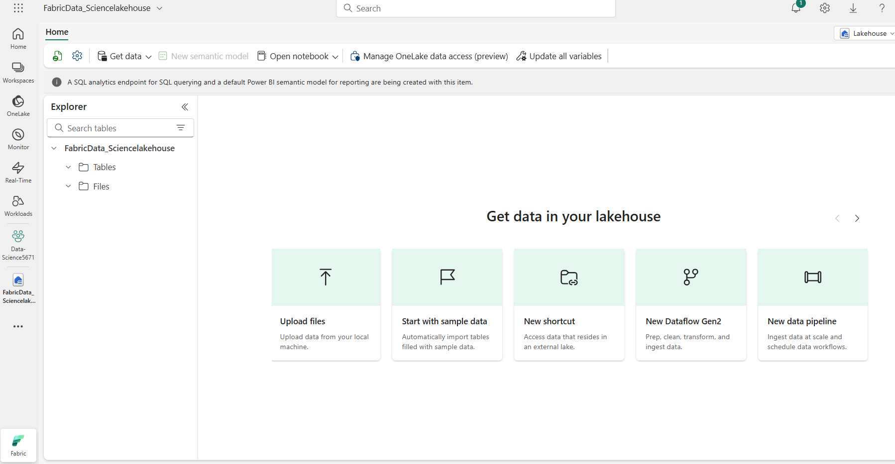

4.  You will see a notification stating **Successfully created SQL
    endpoint**.

> 

## **Task 3: Use Apache Spark to ingest data into a Microsoft Fabric lakehouse**

**Bank churn data**

The dataset contains churn status of 10,000 customers. It also includes
attributes that could impact churn such as:

- Credit score

- Geographical location (Germany, France, Spain)

- Gender (male, female)

- Age

- Tenure (years of being bank's customer)

- Account balance

- Estimated salary

- Number of products that a customer has purchased through the bank

- Credit card status (whether a customer has a credit card or not)

- Active member status (whether an active bank's customer or not)

The dataset also includes columns such as row number, customer ID, and
customer surname that should have no impact on customer's decision to
leave the bank.

The event that defines the customer's churn is the closing of the
customer's bank account. The column exited in the dataset refers to
customer's abandonment. There isn't much context available about these
attributes so you have to proceed without having background information
about the dataset. The aim is to understand how these attributes
contribute to the exited status.

1.  In the **Lakehouse** page, dropdown the **Open notebook** and select
    **New notebook.**

> 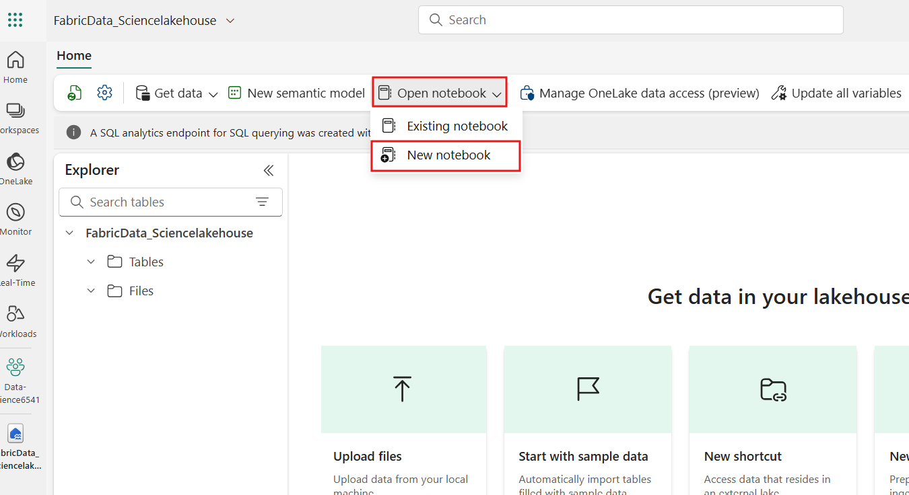
>
> 

2.  Download dataset and upload to lakehouse, enter the following code
    and click on the **play** button to execute cell.

IS_CUSTOM_DATA = False \# if TRUE, dataset has to be uploaded manually

DATA_ROOT = "/lakehouse/default"

DATA_FOLDER = "Files/churn" \# folder with data files

DATA_FILE = "churn.csv" \# data file name

3.  In your notebook, use the **+ Code** icon below the latest cell
    output to add a new code cell to the notebook.

4.  Enter the following code.This code downloads a publicly available
    version of the dataset and then stores it in a Fabric lakehouse.
    Select the code cell and click on the **play** button to execute
    cell.

import os, requests

if not IS_CUSTOM_DATA:

\# Download demo data files into lakehouse if not exist

remote_url =
"https://synapseaisolutionsa.z13.web.core.windows.net/data/bankcustomerchurn"

file_list = \[DATA_FILE\]

download_path = f"{DATA_ROOT}/{DATA_FOLDER}/raw"

if not os.path.exists("/lakehouse/default"):

raise FileNotFoundError(

"Default lakehouse not found, please add a lakehouse and restart the
session."

)

os.makedirs(download_path, exist_ok=True)

for fname in file_list:

if not os.path.exists(f"{download_path}/{fname}"):

r = requests.get(f"{remote_url}/{fname}", timeout=30)

with open(f"{download_path}/{fname}", "wb") as f:

f.write(r.content)

print("Downloaded demo data files into lakehouse.")

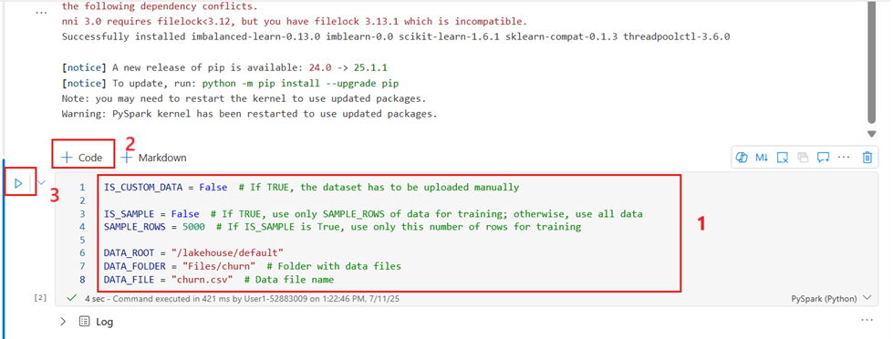

## **Task 4: Explore and visualize data using Microsoft Fabric notebooks**

1.  Read raw data from the **Files** section of the lakehouse. You
    uploaded this data in the above cell.

2.  Use the **+ Code** icon below the cell output to add a new code cell
    to the notebook, and enter the following code in it. Click on **▷
    Run cell** button and review the output

df = (

spark.read.option("header", True)

.option("inferSchema", True)

.csv("Files/churn/raw/churn.csv")

.cache()

)

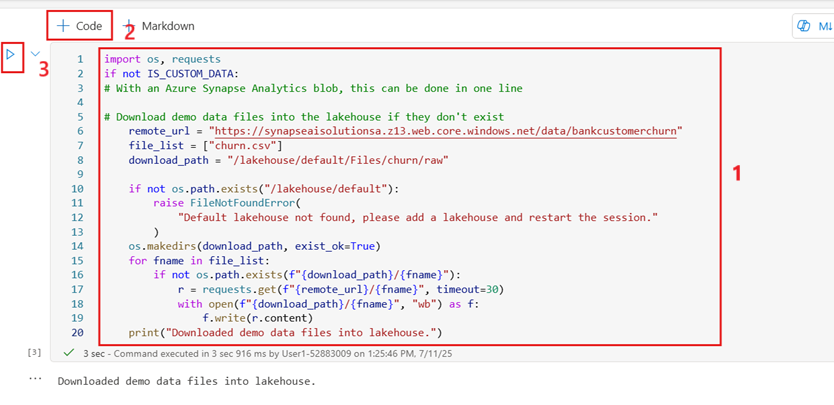

3.  Convert the spark DataFrame to pandas DataFrame for easier
    processing and visualization.

4.  Use the **+ Code** icon below the cell output to add a new code cell
    to the notebook, and enter the following code in it. Click on **▷
    Run cell** button and review the output

df = df.toPandas()

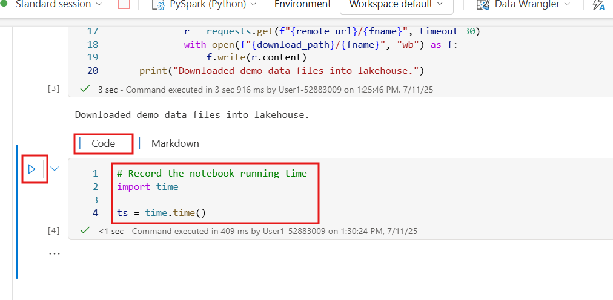

5.  Explore the raw data with display, do some basic statistics and show
    chart views. You first need to import required libraries for data
    visualization such as seaborn, which is a Python data visualization
    library to provide a high-level interface for building visuals on
    DataFrames and arrays.

6.  Use the **+ Code** icon below the cell output to add a new code cell
    to the notebook, and enter the following code in it. Click on **▷
    Run cell** button and review the output

import seaborn as sns

sns.set_theme(style="whitegrid", palette="tab10", rc =
{'figure.figsize':(9,6)})

import matplotlib.pyplot as plt

import matplotlib.ticker as mticker

from matplotlib import rc, rcParams

import numpy as np

import pandas as pd

import itertools

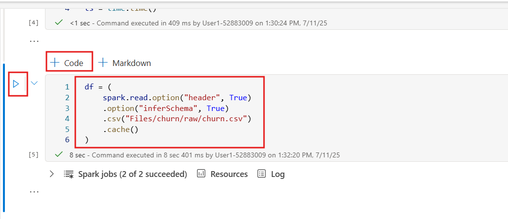

7.  Use the **+ Code** icon below the cell output to add a new code cell
    to the notebook, and enter the following code in it. Click on **▷
    Run cell** button and review the output

> display(df, summary=True)

8.  Use Data Wrangler to perform initial data cleansing, under the
    notebook ribbon select **AI tool** tab , dropdown the **Data
    Wrangler** and select the **df** data wrangler.

9.  Once the Data Wrangler is launched, a descriptive overview of the
    displayed data panel is generated.

10. In df(Data Wrangler) pane, under **Operations** select the **Find
    and replace\>Drop duplicate rows.**

11. Under the Target columns, select the **RowNumber and CustomerId**
    check boxs**,** and then click on the **Apply** button.

12. In df(Data Wrangler) pane, under **Operations** select the **Find
    and replace\>Drop missing values.**

13. Under the Target columns, choose **Select all** from the **Target
    columns**.**,** and then click on the **Apply** button.

14. Expand **Schema** and select **Drop columns**.

15. Select **RowNumber**, **CustomerId**, **Surname**. These columns
    appear in red in the preview, to show they're changed by the code
    (in this case, dropped.)

16. Select **Apply** to go on to the next step

17. Select **Add code to notebook** at the top left to close Data
    Wrangler and add the code automatically. The **Add code to
    notebook** wraps the code in a function, then calls the function.

18. The code generated by Data Wrangler 

19. his code is similar to the code produced by Data Wrangler, but adds
    in the argument inplace=True to each of the generated steps. By
    setting inplace=True, pandas will overwrite the original DataFrame
    instead of producing a new DataFrame as an output.

20. Click on **▷ Run cell** button and review the output

**Reference code:**

\# Modified version of code generated by Data Wrangler

\# Modification is to add in-place=True to each step

\# Define a new function that include all above Data Wrangler operations

def clean_data(df):

\# Drop rows with missing data across all columns

df.dropna(inplace=True)

\# Drop duplicate rows in columns: 'RowNumber', 'CustomerId'

df.drop_duplicates(subset=\['RowNumber', 'CustomerId'\], inplace=True)

\# Drop columns: 'RowNumber', 'CustomerId', 'Surname'

df.drop(columns=\['RowNumber', 'CustomerId', 'Surname'\], inplace=True)

return df

df_clean = clean_data(df.copy())

df_clean.head()

21. Use this code to determine categorical, numerical, and target
    attributes. Use the **+ Code** icon below the cell output to add a
    new code cell to the notebook, and enter the following code in it.
    Click on **▷ Run cell** button and review the output

\# Determine the dependent (target) attribute

dependent_variable_name = "Exited"

print(dependent_variable_name)

\# Determine the categorical attributes

categorical_variables = \[col for col in df_clean.columns if col in "O"

or df_clean\[col\].nunique() \<=5

and col not in "Exited"\]

print(categorical_variables)

\# Determine the numerical attributes

numeric_variables = \[col for col in df_clean.columns if
df_clean\[col\].dtype != "object"

and df_clean\[col\].nunique() \>5\]

print(numeric_variables)

> 

22. The code below generates box plots to display the five-number
    summary—minimum, first quartile, median, third quartile, and
    maximum—for the numerical attributes.

23. Use the **+ Code** icon below the cell output to add a new code cell
    to the notebook, and enter the following code in it. Click on **▷
    Run cell** button and review the output

24. To show the distribution of exited versus nonexited customers across
    the categorical attributes.

25. Use the **+ Code** icon below the cell output to add a new code cell
    to the notebook, and enter the following code in it. Click on **▷
    Run cell** button and review the output

26. Show the frequency distribution of numerical attributes using
    histogram.

27. Use the **+ Code** icon below the cell output to add a new code cell
    to the notebook, and enter the following code in it. Click on **▷
    Run cell** button and review the output

28. Perform feature engineering to create new attributes derived from
    the existing ones.

29. Use the **+ Code** icon below the cell output to add a new code cell
    to the notebook, and enter the following code in it. Click on **▷
    Run cell** button and review the output

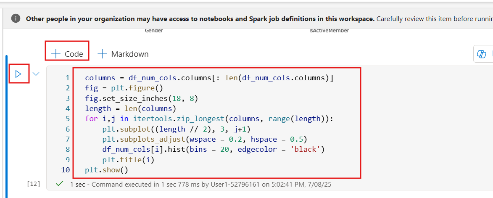

## **Task 5: Use Data Wrangler to perform one-hot encoding**

Data Wrangler can also be used to perform one-hot encoding. To do so,
re-open Data Wrangler. This time, select the df_clean data.

1.  Use Data Wrangler to perform initial data cleansing, under the
    notebook ribbon select **AI tool** tab , dropdown the **Data
    Wrangler** and select the **df_clean** data wrangler.

2.  Expand **Formulas** and select **One-hot encode**.

3.  A panel appears for you to select the list of columns you want to
    perform one-hot encoding on. Select **Geography** and **Gender**.
    Click on **Apply** button.

4.  Select **Add code to notebook** at the top left to close Data
    Wrangler and add the code automatically

5.  Click on **▷ Run cell** button and review the output

## **Task 6: Create a delta table for the cleaned data**

1.  Use the **+ Code** icon below the cell output to add a new code cell
    to the notebook, and enter the following code in it. Click on **▷
    Run cell** button and review the output

table_name = "df_clean"

\# Create Spark DataFrame from pandas

sparkDF=spark.createDataFrame(df_clean_1)

sparkDF.write.mode("overwrite").format("delta").save(f"Tables/{table_name}")

print(f"Spark dataframe saved to delta table: {table_name}")

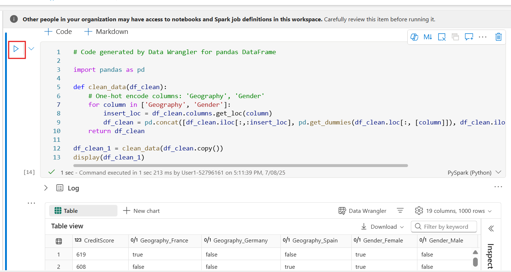

## **Task 7: Train and register a machine learning model**

Install the imbalanced-learn library (imported as imblearn) using %pip
install; this library provides techniques like SMOTE for addressing
imbalanced datasets. Since the PySpark kernel will restart after
installation, ensure this cell is run before executing any others.

1.  Use the **+ Code** icon below the cell output to add a new code cell
    to the notebook, and enter the following code in it. Click on **▷
    Run cell** button and review the output.

\# Install imblearn for SMOTE using pip

%pip install imblearn

> 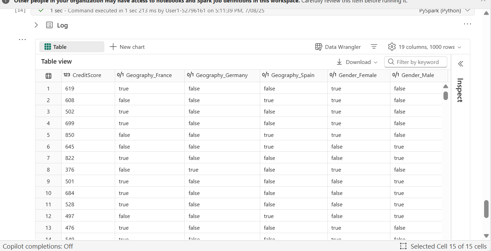

2.  Before training any machine learning model, ensure you load the
    Delta table from the Lakehouse to access the cleaned dataset
    prepared in the previous task.

3.  Use the **+ Code** icon below the cell output to add a new code cell
    to the notebook, and enter the following code in it. Click on **▷
    Run cell** button and review the output.

import pandas as pd

SEED = 12345

df_clean = spark.read.format("delta").load("Tables/df_clean").toPandas()

> 

4.  To generate experiment for tracking and logging the model using
    MLflow. Use the **+ Code** icon below the cell output to add a new
    code cell to the notebook, and enter the following code in it. Click
    on **▷ Run cell** button and review the output.

import mlflow

\# Setup experiment name

EXPERIMENT_NAME = "bank-churn-experiment" \# MLflow experiment name

> 

5.  Set experiment and autologging specifications. Use the **+
    Code** icon below the cell output to add a new code cell to the
    notebook, and enter the following code in it. Click on **▷ Run
    cell** button and review the output.

mlflow.set_experiment(EXPERIMENT_NAME)

mlflow.autolog(exclusive=False)

> 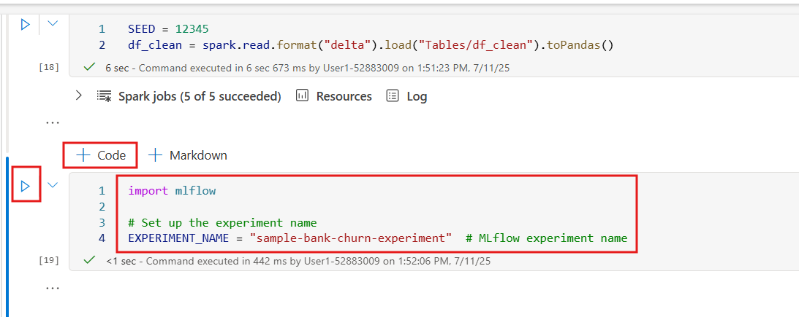

6.  With the data now loaded, the next step is to define and train
    machine learning models. This notebook demonstrates how to implement
    Random Forest and **LightGBM** using the **scikit-learn** and
    **lightgbm** libraries in just a few lines of code.

7.  Use the **+ Code** icon below the cell output to add a new code cell
    to the notebook, and enter the following code in it. Click on **▷
    Run cell** button and review the output

> \# Import the required libraries for model training
>
> from sklearn.model_selection import train_test_split
>
> from lightgbm import LGBMClassifier
>
> from sklearn.ensemble import RandomForestClassifier
>
> from sklearn.metrics import accuracy_score, f1_score, precision_score,
> confusion_matrix, recall_score, roc_auc_score, classification_report
>
> 

8.  Use the train_test_split function from **scikit-learn** to split the
    data into training, validation, and test sets.

9.  Use the **+ Code** icon below the cell output to add a new code cell
    to the notebook, and enter the following code in it. Click on **▷
    Run cell** button and review the output

y = df_clean\["Exited"\]

X = df_clean.drop("Exited",axis=1)

\# Split the dataset to 60%, 20%, 20% for training, validation, and test
datasets

\# Train-Test Separation

X_train, X_test, y_train, y_test = train_test_split(X, y,
test_size=0.20, random_state=SEED)

\# Train-Validation Separation

X_train, X_val, y_train, y_val = train_test_split(X_train, y_train,
test_size=0.25, random_state=SEED)

> 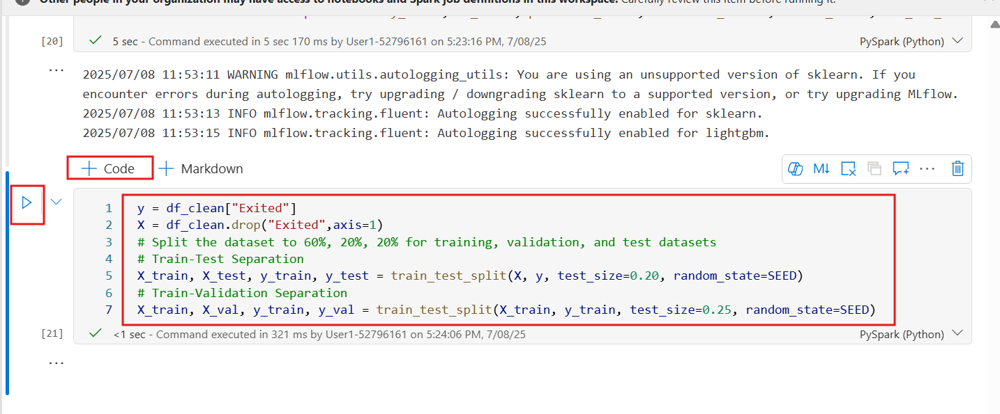

10. Save the test data to the delta table for use in the next step. Use
    the **+ Code** icon below the cell output to add a new code cell to
    the notebook, and enter the following code in it. Click on **▷ Run
    cell** button and review the output

table_name = "df_test"

\# Create PySpark DataFrame from Pandas

df_test=spark.createDataFrame(X_test)

df_test.write.mode("overwrite").format("delta").save(f"Tables/{table_name}")

print(f"Spark test DataFrame saved to delta table: {table_name}")

> 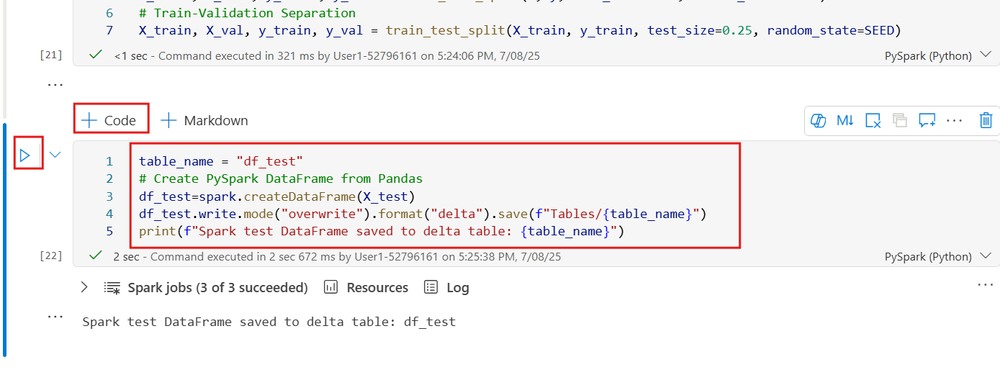

11. Apply SMOTE to the training data to synthesize new samples for the
    minority class. Use the **+ Code** icon below the cell output to add
    a new code cell to the notebook, and enter the following code in it.
    Click on **▷ Run cell** button and review the output

from collections import Counter

from imblearn.over_sampling import SMOTE

sm = SMOTE(random_state=SEED)

X_res, y_res = sm.fit_resample(X_train, y_train)

new_train = pd.concat(\[X_res, y_res\], axis=1)

> 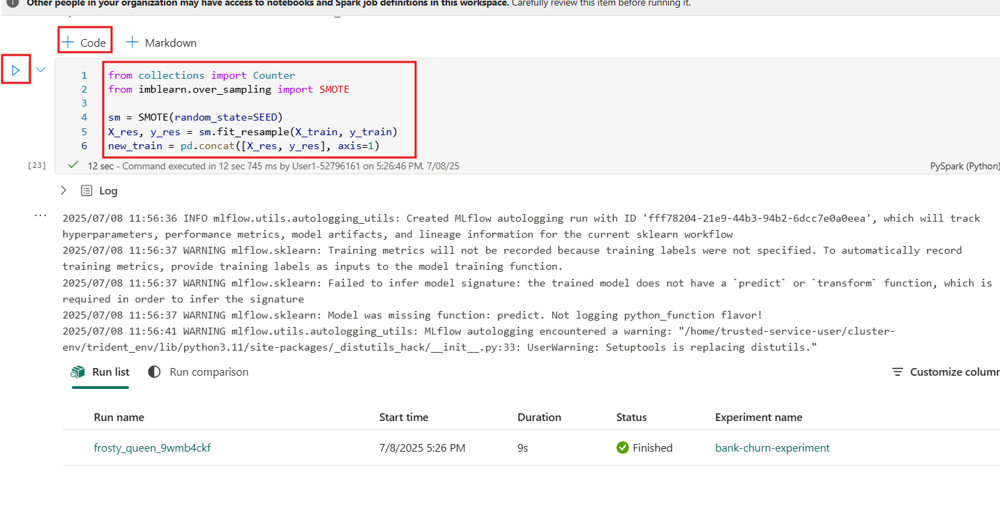

12. Train the model using Random Forest with maximum depth of 4 and 4
    features. Use the **+ Code** icon below the cell output to add a new
    code cell to the notebook, and enter the following code in it. Click
    on **▷ Run cell** button and review the output

> mlflow.sklearn.autolog(registered_model_name='rfc1_sm') \# Register
> the trained model with autologging
>
> rfc1_sm = RandomForestClassifier(max_depth=4, max_features=4,
> min_samples_split=3, random_state=1) \# Pass hyperparameters
>
> with mlflow.start_run(run_name="rfc1_sm") as run:
>
> rfc1_sm_run_id = run.info.run_id \# Capture run_id for model
> prediction later
>
> print("run_id: {}; status: {}".format(rfc1_sm_run_id,
> run.info.status))
>
> \# rfc1.fit(X_train,y_train) \# Imbalanaced training data
>
> rfc1_sm.fit(X_res, y_res.ravel()) \# Balanced training data
>
> rfc1_sm.score(X_val, y_val)
>
> y_pred = rfc1_sm.predict(X_val)
>
> cr_rfc1_sm = classification_report(y_val, y_pred)
>
> cm_rfc1_sm = confusion_matrix(y_val, y_pred)
>
> roc_auc_rfc1_sm = roc_auc_score(y_res,
> rfc1_sm.predict_proba(X_res)\[:, 1\])
>
> 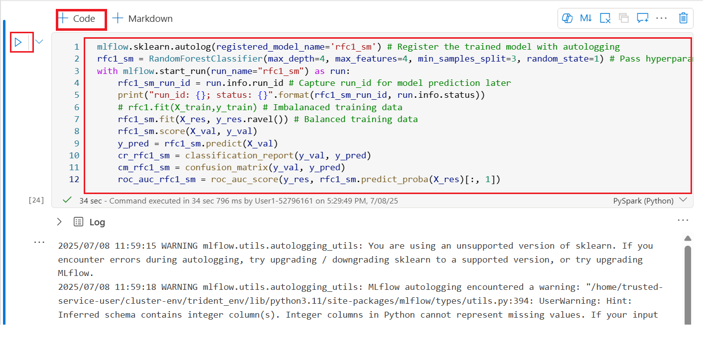
>
> 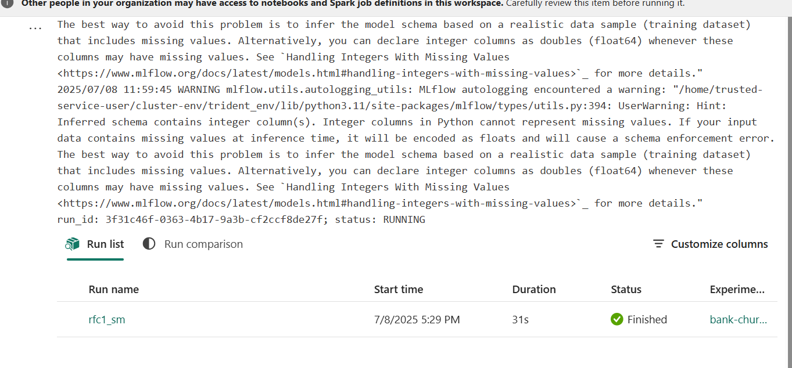

13. Train the model using Random Forest with maximum depth of 8 and 6
    features. Use the **+ Code** icon below the cell output to add a new
    code cell to the notebook, and enter the following code in it. Click
    on **▷ Run cell** button and review the output

mlflow.sklearn.autolog(registered_model_name='rfc2_sm') \# Register the
trained model with autologging

rfc2_sm = RandomForestClassifier(max_depth=8, max_features=6,
min_samples_split=3, random_state=1) \# Pass hyperparameters

with mlflow.start_run(run_name="rfc2_sm") as run:

rfc2_sm_run_id = run.info.run_id \# Capture run_id for model prediction
later

print("run_id: {}; status: {}".format(rfc2_sm_run_id, run.info.status))

\# rfc2.fit(X_train,y_train) \# Imbalanced training data

rfc2_sm.fit(X_res, y_res.ravel()) \# Balanced training data

rfc2_sm.score(X_val, y_val)

y_pred = rfc2_sm.predict(X_val)

cr_rfc2_sm = classification_report(y_val, y_pred)

cm_rfc2_sm = confusion_matrix(y_val, y_pred)

roc_auc_rfc2_sm = roc_auc_score(y_res, rfc2_sm.predict_proba(X_res)\[:,
1\])

> 
>
> 

14. Train the model using LightGBM. Use the **+ Code** icon below the
    cell output to add a new code cell to the notebook, and enter the
    following code in it. Click on **▷ Run cell** button and review the
    output

\# lgbm_model

mlflow.lightgbm.autolog(registered_model_name='lgbm_sm') \# Register the
trained model with autologging

lgbm_sm_model = LGBMClassifier(learning_rate = 0.07,

max_delta_step = 2,

n_estimators = 100,

max_depth = 10,

eval_metric = "logloss",

objective='binary',

random_state=42)

with mlflow.start_run(run_name="lgbm_sm") as run:

lgbm1_sm_run_id = run.info.run_id \# Capture run_id for model prediction
later

\# lgbm_sm_model.fit(X_train,y_train) \# Imbalanced training data

lgbm_sm_model.fit(X_res, y_res.ravel()) \# Balanced training data

y_pred = lgbm_sm_model.predict(X_val)

accuracy = accuracy_score(y_val, y_pred)

cr_lgbm_sm = classification_report(y_val, y_pred)

cm_lgbm_sm = confusion_matrix(y_val, y_pred)

roc_auc_lgbm_sm = roc_auc_score(y_res,
lgbm_sm_model.predict_proba(X_res)\[:, 1\])

> 

## Task 8: Experiments artifact for tracking model performance

1.  Select **Data-ScienceXXX** in the left navigation pane.

> 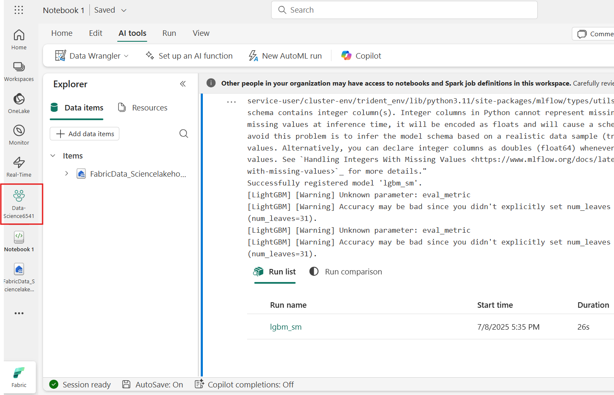

2.  On the top right, drop down the filter and select Experiments.

3.  Select **bank-churn-experiment**

> 

## **Task 9: Assess the performances of the trained models on the validation dataset**

1.  Select **Notebook1** in the left navigation pane.

> 

2.  Open the saved experiment from the workspace, load the machine
    learning models, and evaluate their performance on the validation
    dataset.

3.  Use the **+ Code** icon below the cell output to add a new code cell
    to the notebook, and enter the following code in it. Click on **▷
    Run cell** button and review the output

\# Define run_uri to fetch the model

\# mlflow client: mlflow.model.url, list model

load_model_rfc1_sm =
mlflow.sklearn.load_model(f"runs:/{rfc1_sm_run_id}/model")

load_model_rfc2_sm =
mlflow.sklearn.load_model(f"runs:/{rfc2_sm_run_id}/model")

load_model_lgbm1_sm =
mlflow.lightgbm.load_model(f"runs:/{lgbm1_sm_run_id}/model")

\# Assess the performance of the loaded model on validation dataset

ypred_rfc1_sm_v1 = load_model_rfc1_sm.predict(X_val) \# Random Forest
with max depth of 4 and 4 features

ypred_rfc2_sm_v1 = load_model_rfc2_sm.predict(X_val) \# Random Forest
with max depth of 8 and 6 features

ypred_lgbm1_sm_v1 = load_model_lgbm1_sm.predict(X_val) \# LightGBM

> 

4.  Directly assess the performance of the trained machine learning
    models on the validation dataset.

5.  Use the **+ Code** icon below the cell output to add a new code cell
    to the notebook, and enter the following code in it. Click on **▷
    Run cell** button and review the output

> ypred_rfc1_sm_v2 = rfc1_sm.predict(X_val) \# Random Forest with max
> depth of 4 and 4 features
>
> ypred_rfc2_sm_v2 = rfc2_sm.predict(X_val) \# Random Forest with max
> depth of 8 and 6 features
>
> ypred_lgbm1_sm_v2 = lgbm_sm_model.predict(X_val) \# LightGBM
>
> 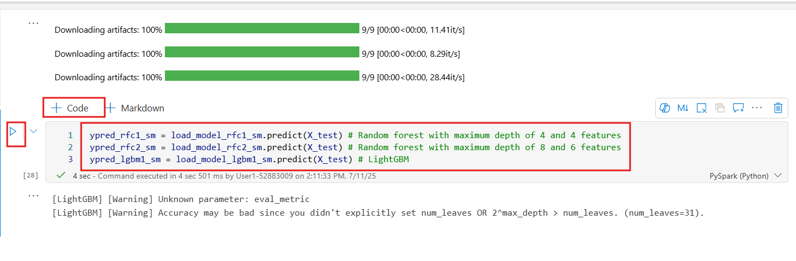

6.  To evaluate the accuracy of the classification model, generate and
    analyze the confusion matrix using predictions from the validation
    dataset.

7.  Use the **+ Code** icon below the cell output to add a new code cell
    to the notebook, and enter the following code in it. Click on **▷
    Run cell** button and review the output

import seaborn as sns

sns.set_theme(style="whitegrid", palette="tab10", rc =
{'figure.figsize':(9,6)})

import matplotlib.pyplot as plt

import matplotlib.ticker as mticker

from matplotlib import rc, rcParams

import numpy as np

import itertools

def plot_confusion_matrix(cm, classes,

normalize=False,

title='Confusion matrix',

cmap=plt.cm.Blues):

print(cm)

plt.figure(figsize=(4,4))

plt.rcParams.update({'font.size': 10})

plt.imshow(cm, interpolation='nearest', cmap=cmap)

plt.title(title)

plt.colorbar()

tick_marks = np.arange(len(classes))

plt.xticks(tick_marks, classes, rotation=45, color="blue")

plt.yticks(tick_marks, classes, color="blue")

fmt = '.2f' if normalize else 'd'

thresh = cm.max() / 2.

for i, j in itertools.product(range(cm.shape\[0\]),
range(cm.shape\[1\])):

plt.text(j, i, format(cm\[i, j\], fmt),

horizontalalignment="center",

color="red" if cm\[i, j\] \> thresh else "black")

plt.tight_layout()

plt.ylabel('True label')

plt.xlabel('Predicted label')

> 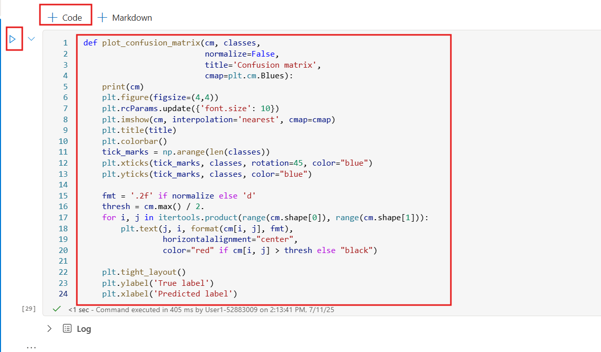
>
> 

8.  Confusion Matrix for Random Forest Classifier with maximum depth of
    4 and 4 features

9.  Use the **+ Code** icon below the cell output to add a new code cell
    to the notebook, and enter the following code in it. Click on **▷
    Run cell** button and review the output

cfm = confusion_matrix(y_val, y_pred=ypred_rfc1_sm_v1)

plot_confusion_matrix(cfm, classes=\['Non Churn','Churn'\],

title='Random Forest with max depth of 4')

tn, fp, fn, tp = cfm.ravel()

> 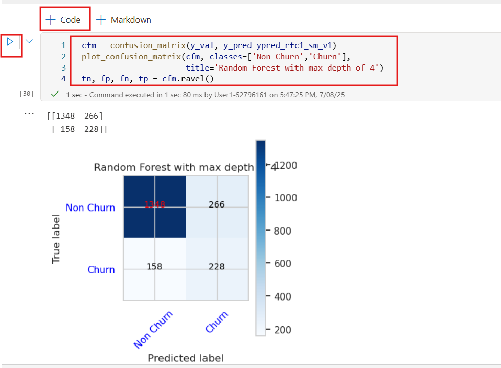

10. Confusion Matrix for Random Forest Classifier with maximum depth of
    8 and 6 features

11. Use the **+ Code** icon below the cell output to add a new code cell
    to the notebook, and enter the following code in it. Click on **▷
    Run cell** button and review the output

cfm = confusion_matrix(y_val, y_pred=ypred_rfc2_sm_v1)

plot_confusion_matrix(cfm, classes=\['Non Churn','Churn'\],

title='Random Forest with max depth of 8')

tn, fp, fn, tp = cfm.ravel()

> 

12. Confusion Matrix for LightGBM. Use the **+ Code** icon below the
    cell output to add a new code cell to the notebook, and enter the
    following code in it. Click on **▷ Run cell** button and review the
    output.

cfm = confusion_matrix(y_val, y_pred=ypred_lgbm1_sm_v1)

plot_confusion_matrix(cfm, classes=\['Non Churn','Churn'\],

title='LightGBM')

tn, fp, fn, tp = cfm.ravel()

> 

## **Task 10: Perform batch scoring and save predictions to a lakehouse**

In this task, you'll learn to import the registered LightGBMClassifier
model that was trained in part 3 using the Microsoft Fabric MLflow model
registry, and perform batch predictions on a test dataset loaded from a
lakehouse.

** **Microsoft Fabric allows you to operationalize machine learning
models with a scalable function called PREDICT, which supports batch
scoring in any compute engine. You can generate batch predictions
directly from a Microsoft Fabric notebook or from a given model's item
page. Learn about [PREDICT](https://aka.ms/fabric-predict).

To generate batch predictions on the test dataset, you'll use version 1
of the trained LightGBM model that demonstrated the best performance
among all trained machine learning models. You'll load the test dataset
into a spark DataFrame and create an MLFlowTransformer object to
generate batch predictions. You can then invoke the PREDICT function
using one of following three ways:

- Transformer API from SynapseML

- Spark SQL API

- PySpark user-defined function (UDF)

1.  Load the test data. Use the **+ Code** icon below the cell output to
    add a new code cell to the notebook, and enter the following code in
    it. Click on **▷ Run cell** button and review the output

df_test = spark.read.format("delta").load("Tables/df_test")

display(df_test)

## **Task 11: Visualize predictions with a Power BI report**

1.  Now, click on **FabricData_Sciencelakehouse** on the left-sided
    navigation pane

2.  Select **New semantic model** on the top ribbon.

3.  In the **New dataset** box, enter the dataset a name, such as **bank
    churn predictions** .Then select
    the **customer_churn_test_predictions** dataset and
    select **Confirm**.

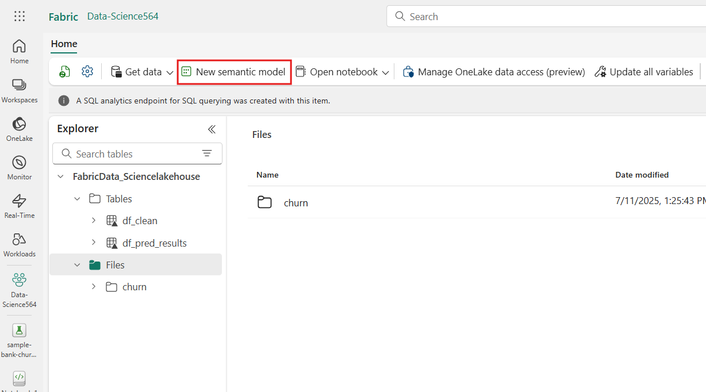

4.  Add a new measure for the churn rate.

&nbsp;

1)  Select **New measure** in the top ribbon. This action adds a new
    item named **Measure** to
    the **customer_churn_test_predictions** dataset, and opens a formula
    bar above the table.

> 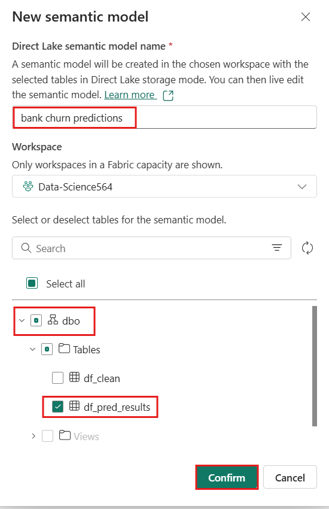

2)  To determine the average predicted churn rate, replace Measure = in
    the formula bar with:

> PythonCopy
>
> **Churn Rate =
> AVERAGE(customer_churn_test_predictions\[predictions\])**
>
> 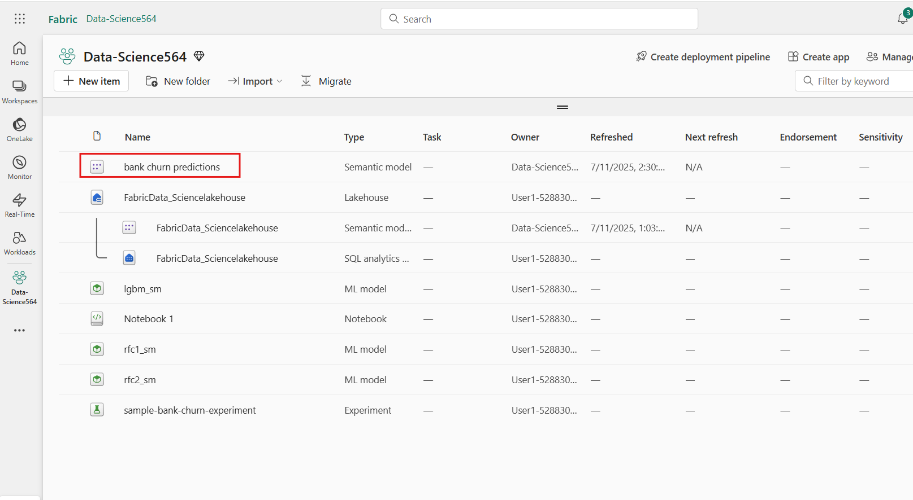

3)  To apply the formula, select the **check mark** in the formula bar.
    The new measure appears in the data table. The calculator icon shows
    it was created as a measure.

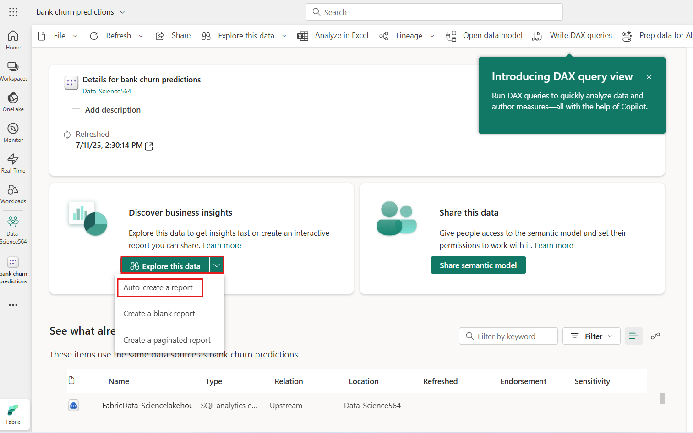

4)  Change the format from **General** to **Percentage** in
    the **Properties** panel.

5)  Scroll down in the **Properties** panel to change the **Decimal
    places** to 1.

> 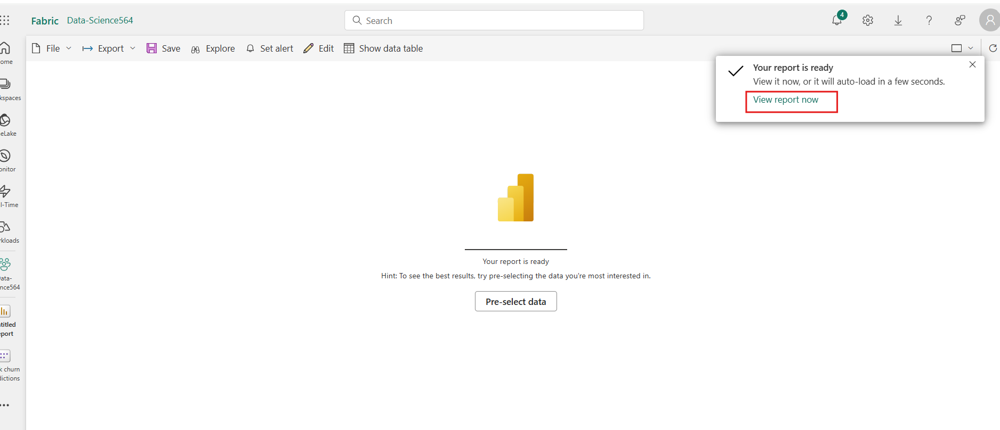

5.  Add a new measure that counts the total number of bank customers.
    You'll need it for the rest of the new measures.

&nbsp;

1)  Select **New measure** in the top ribbon to add a new item
    named **Measure** to the customer_churn_test_predictions dataset.
    This action also opens a formula bar above the table.

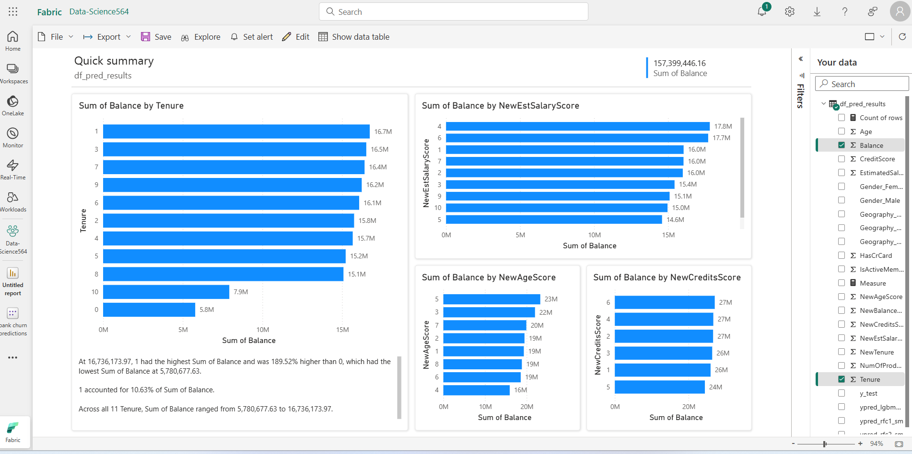

2)  Each prediction represents one customer. To determine the total
    number of customers, replace Measure = in the formula bar with:

> PythonCopy
>
> Customers = COUNT(customer_churn_test_predictions\[predictions\])
>
> 

3)  Select the **check mark** in the formula bar to apply the formula.

> 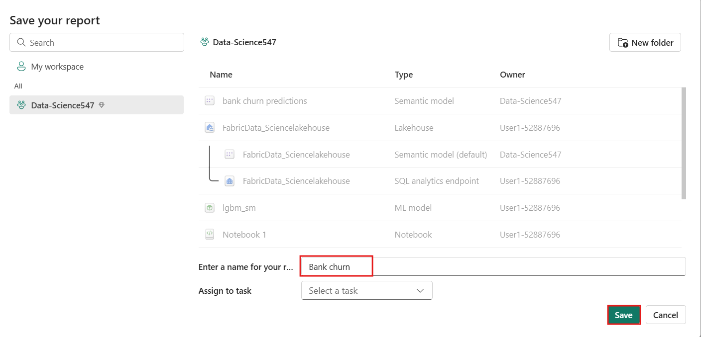

6.  Add the churn rate for Germany.

    1)  Select **New measure** in the top ribbon to add a new item
        named **Measure** to the customer_churn_test_predictions
        dataset. This action also opens a formula bar above the table.

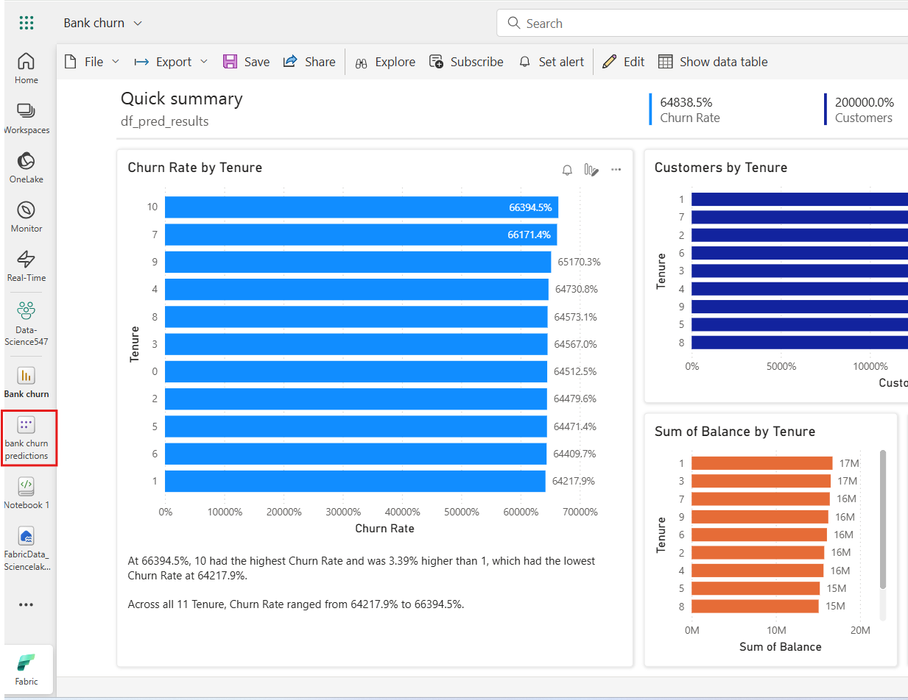

2)  To determine the churn rate for Germany, replace Measure = in the
    formula bar with:

> PythonCopy
>
> Germany Churn = CALCULATE(customer_churn_test_predictions\[Churn
> Rate\], customer_churn_test_predictions\[Geography_Germany\] = 1)
>
> 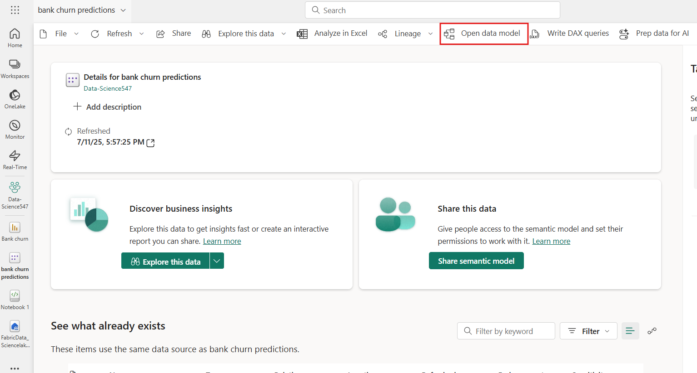

This filters the rows down to the ones with Germany as their geography
(Geography_Germany equals one).

3)  To apply the formula, select the **check mark** in the formula bar.

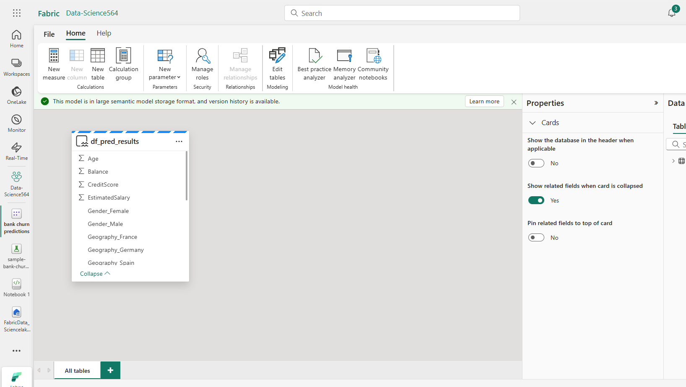

7.  Repeat the above step to add the churn rates for France and Spain.

&nbsp;

1)  **Spain's churn rate**: Select **New measure** in the top ribbon to
    add a new item named **Measure** to the
    customer_churn_test_predictions dataset. This action also opens a
    formula bar above the table.

2)  Select the **check mark** in the formula bar to apply the formula

> PythonCopy
>
> Spain Churn = CALCULATE(customer_churn_test_predictions\[Churn Rate\],
> customer_churn_test_predictions\[Geography_Spain\] = 1)

1)  France's churn rate: Select **New measure** in the top ribbon to add
    a new item named **Measure** to the customer_churn_test_predictions
    dataset. This action also opens a formula bar above the table.

2)  Select the **check mark** in the formula bar to apply the formula

> PythonCopy
>
> France Churn = CALCULATE(customer_churn_test_predictions\[Churn
> Rate\], customer_churn_test_predictions\[Geography_France\] = 1)
>
> 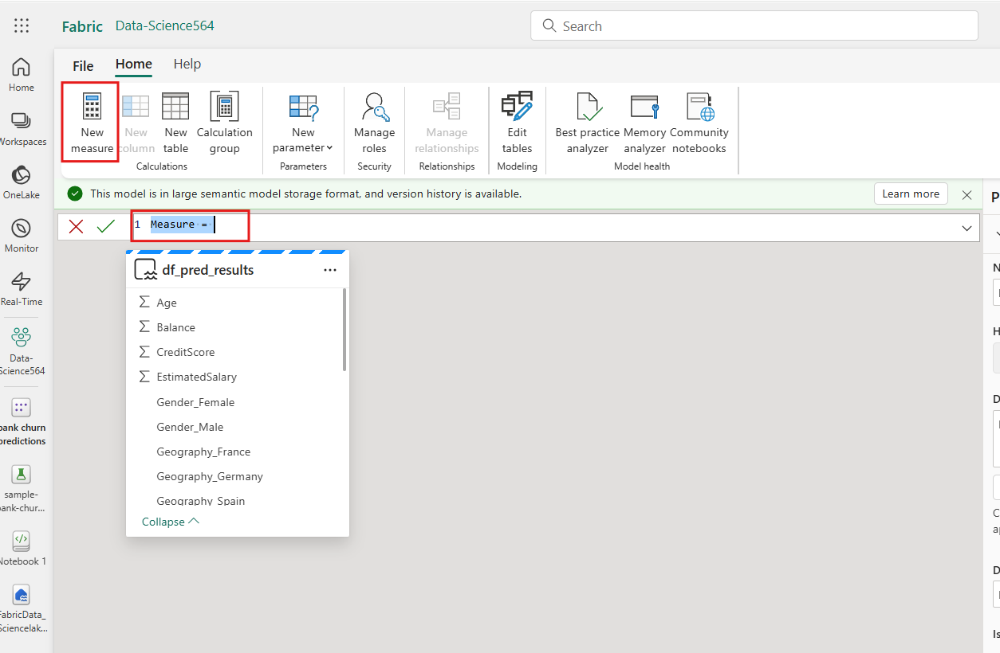

## **Task 12: Create new report**

1.  On the tools at the top of the dataset page, select **New report**
    to open the Power BI report authoring page.

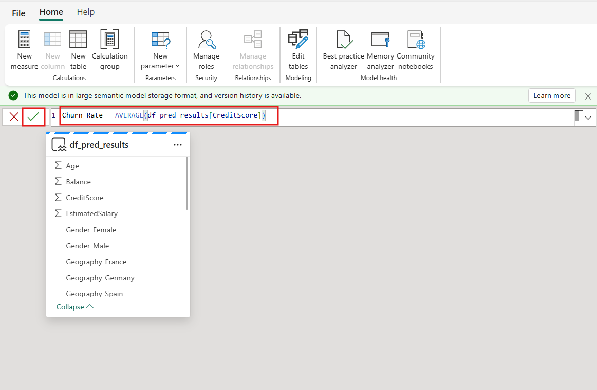

2.  In the Ribbon, select **Text box**. Type in **Bank Customer Churn**.
    **Highlight** the **text** Change the font size and background color
    in the Format panel. Adjust the font size and color by selecting the
    text and using the format bar.

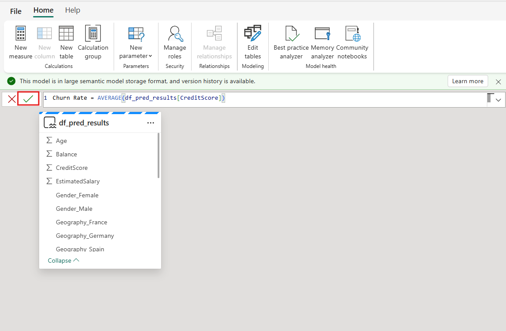

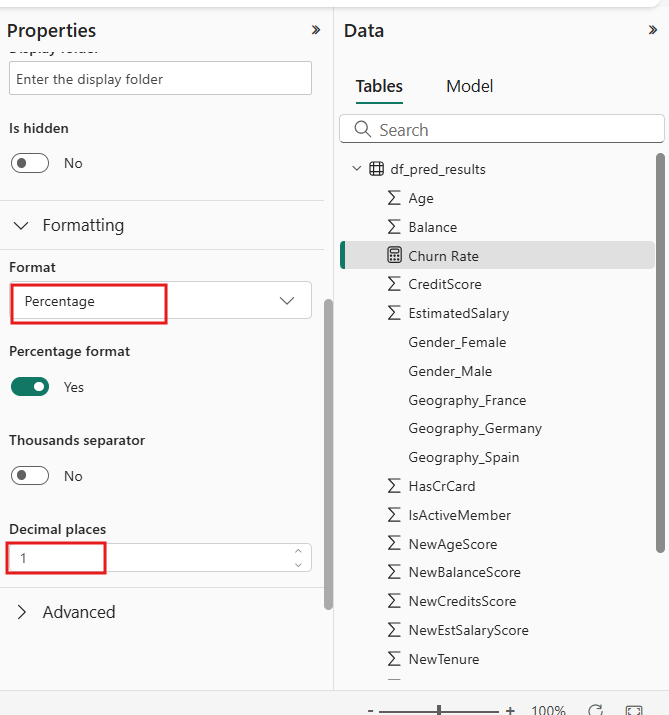

3.  In the Visualizations panel, select the **Card** icon. From
    the **Data** pane, select **Churn Rate**. Change the font size and
    background color in the Format panel. Drag this visualization to the
    top right of the report.

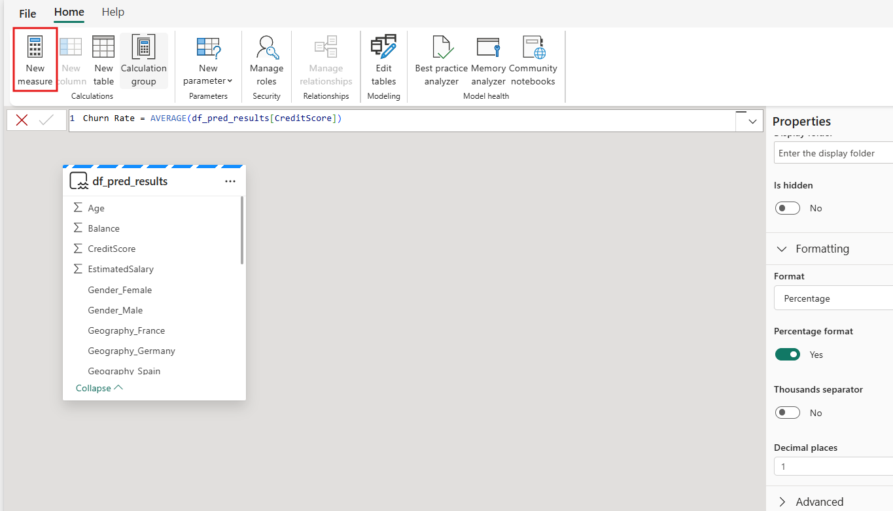

4.  In the Visualizations panel, select the **Line and stacked column
    chart** icon. Select **age** for the x-axis, **Churn Rate** for
    column y-axis, and **Customers** for the line y-axis.

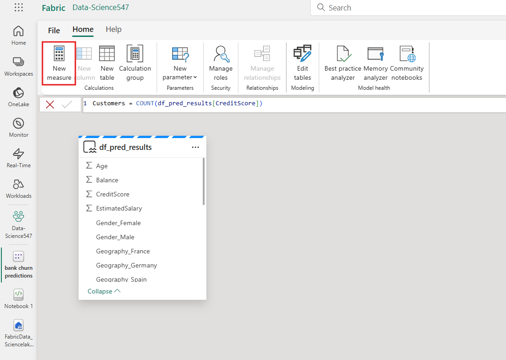

5.  In the Visualizations panel, select the **Line and stacked column
    chart** icon. Select **NumOfProducts** for x-axis, **Churn
    Rate** for column y-axis, and **Customers** for the line y-axis.

> 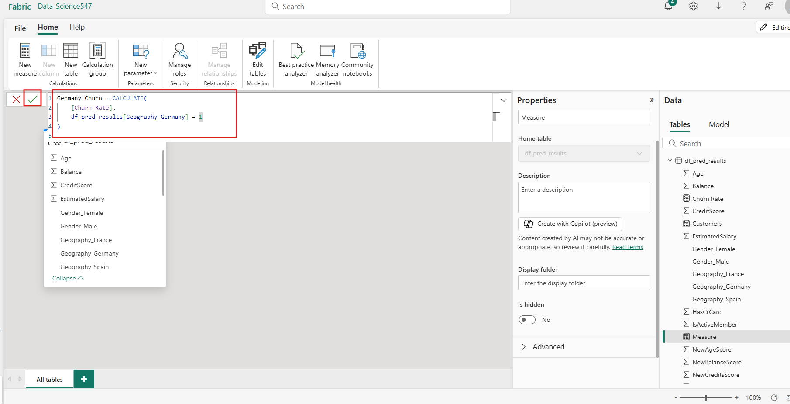

6.  In the Visualizations panel, select the **Stacked column
    chart** icon. Select **NewCreditsScore** for x-axis and **Churn
    Rate** for y-axis.

> 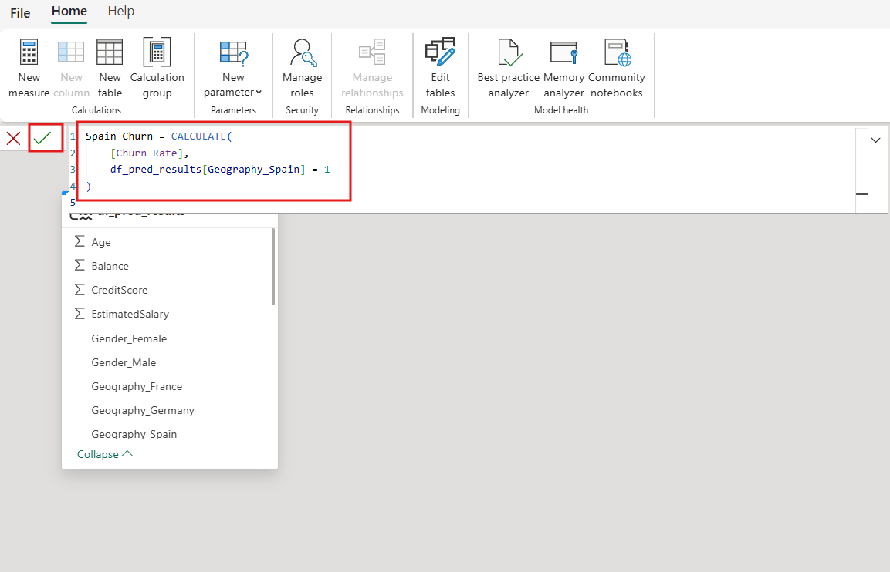

7.  Change the title **NewCreditsScore** to **Credit Score** in the
    Format panel. Select **Format your visuals** and dropdown the
    **X-axis**, enter the Title text as **Credit Score.**

> 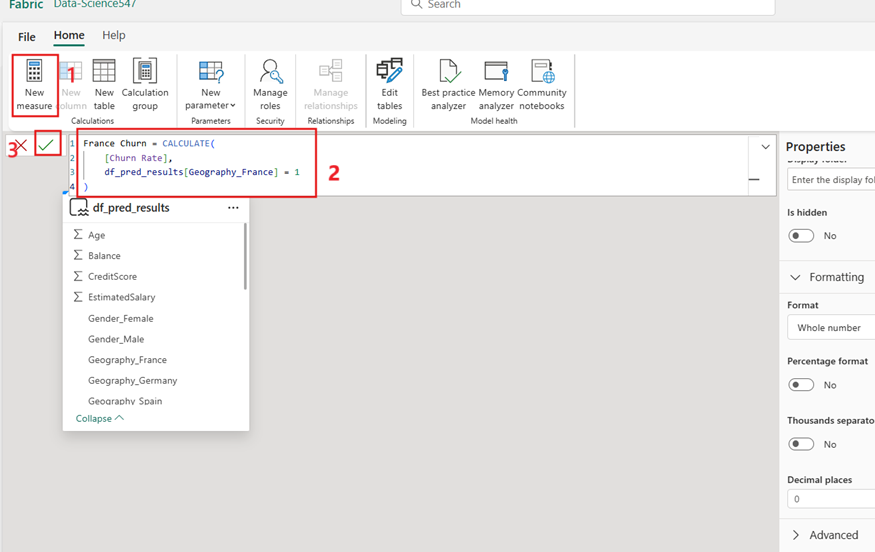
>
> 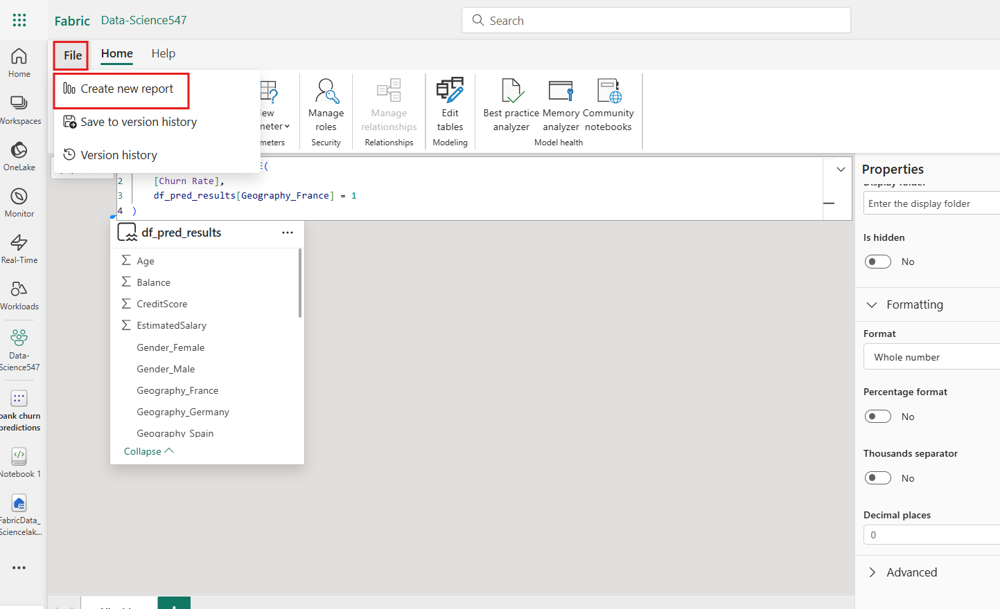

8.  In the Visualizations panel, select the **Clustered column
    chart** card. Select **Germany Churn**, **Spain Churn**, **France
    Churn** in that order for the y-axis.

> 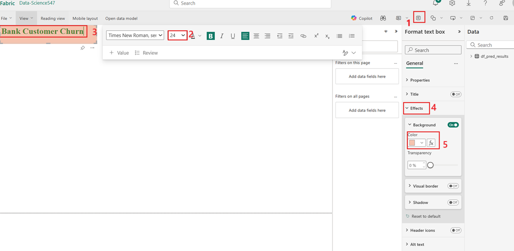
>
> 

The Power BI report shows:

- Customers who use more than two of the bank products have a higher
  churn rate although few customers had more than two products. The bank
  should collect more data, but also investigate other features
  correlated with more products (see the plot in the bottom left panel).

- Bank customers in Germany have a higher churn rate than in France and
  Spain (see the plot in the bottom right panel), which suggests that an
  investigation into what has encouraged customers to leave could be
  beneficial.

- There are more middle aged customers (between 25-45) and customers
  between 45-60 tend to exit more.

- Finally, customers with lower credit scores would most likely leave
  the bank for other financial institutes. The bank should look into
  ways that encourage customers with lower credit scores and account
  balances to stay with the bank.
